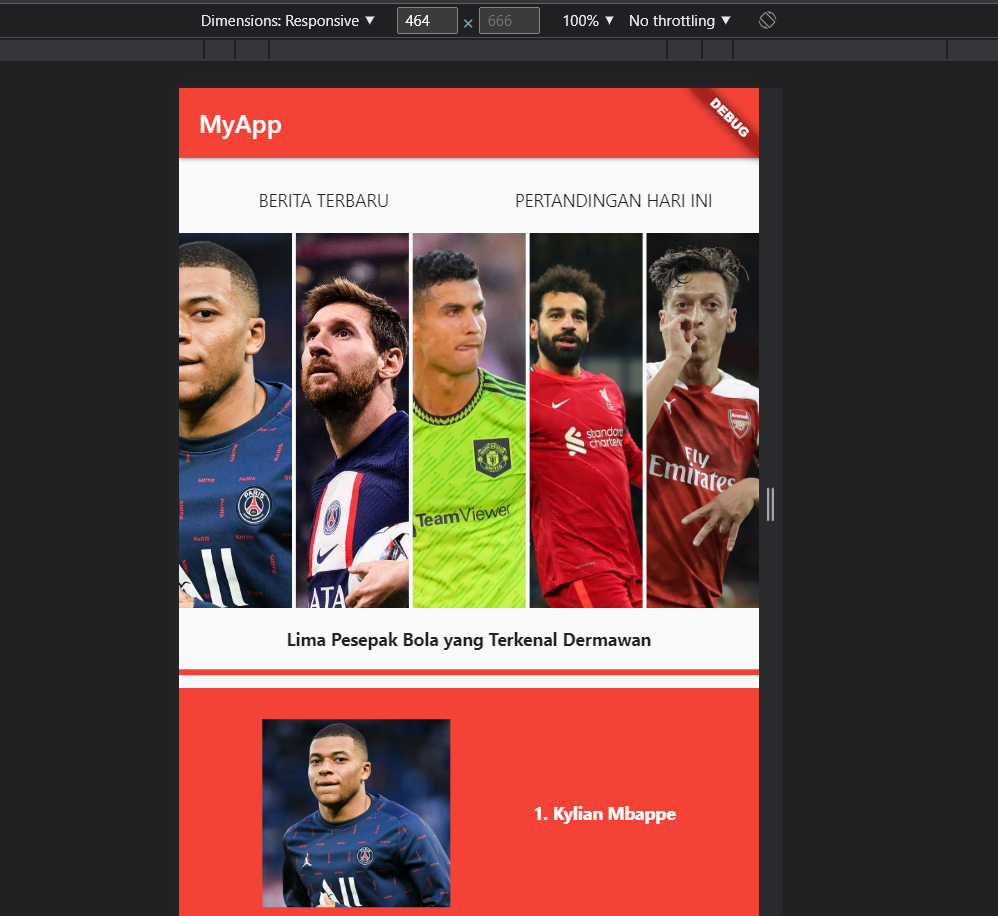
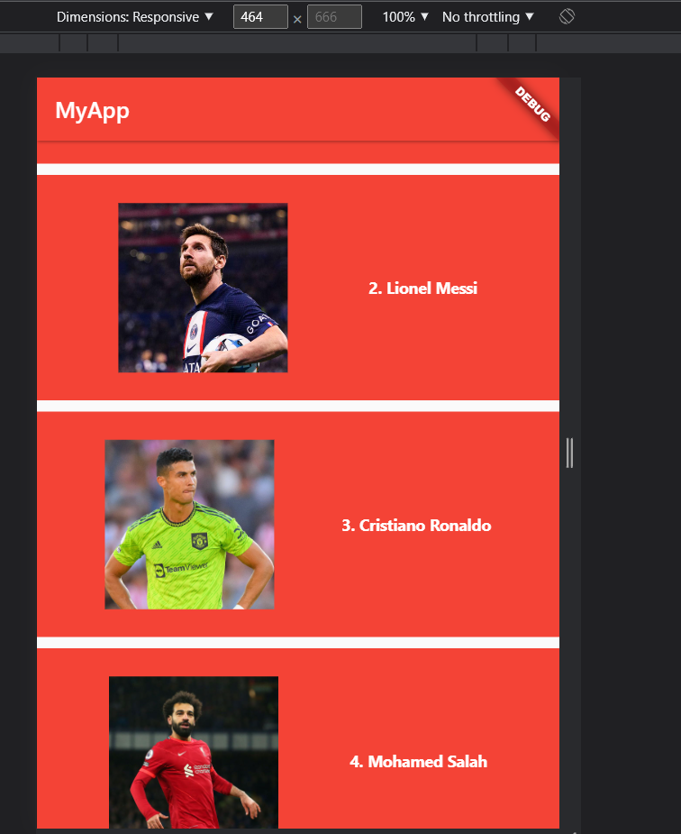

# Flutter Basic Widget

Silakan selesaikan Tugas Praktikum 1 membuat UI sederhana dengan push ke GitHub nama repo: basic_widget

Nama : Yudas Malabi

Kelas : TI 3C / 25

NIM : 2041720054

## Screenshots

